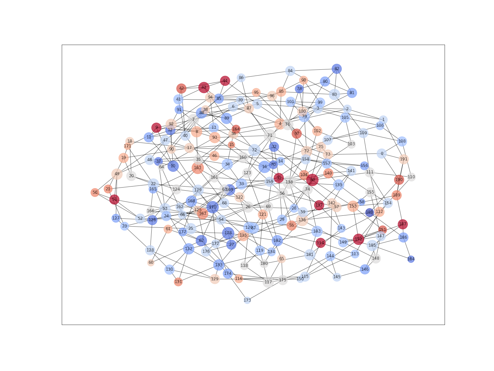
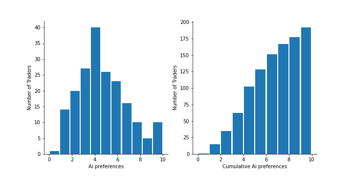
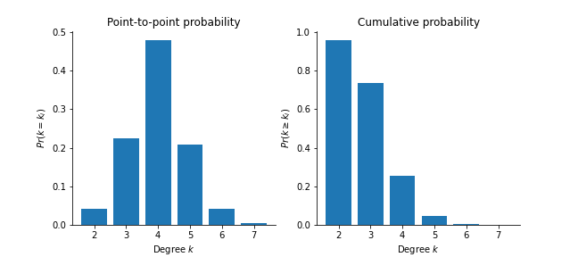
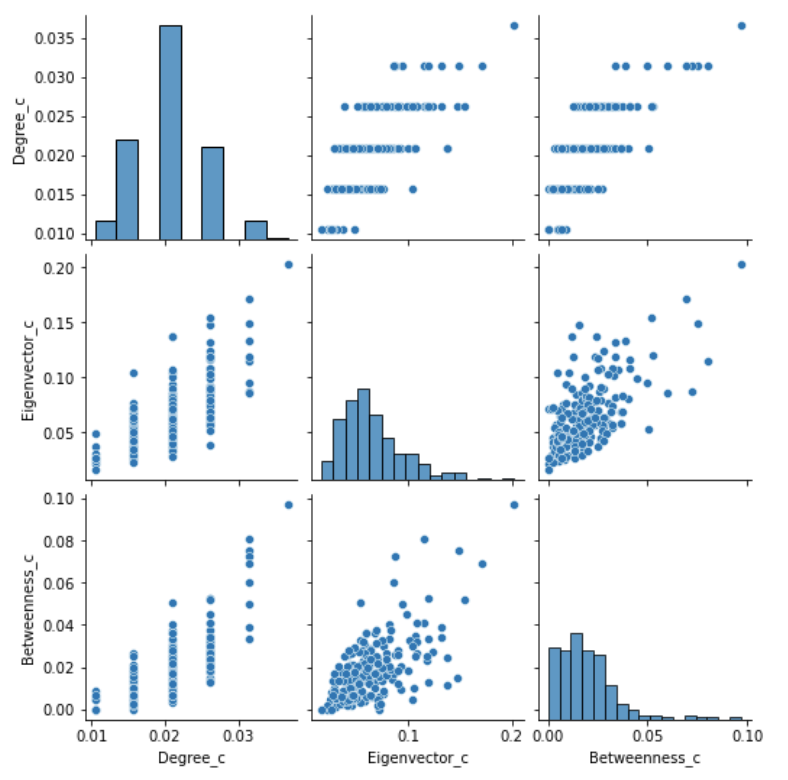
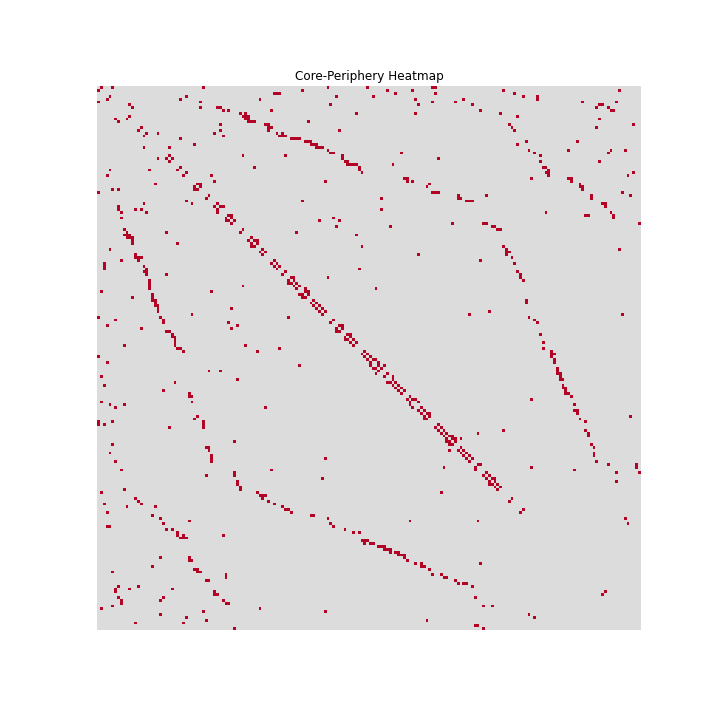
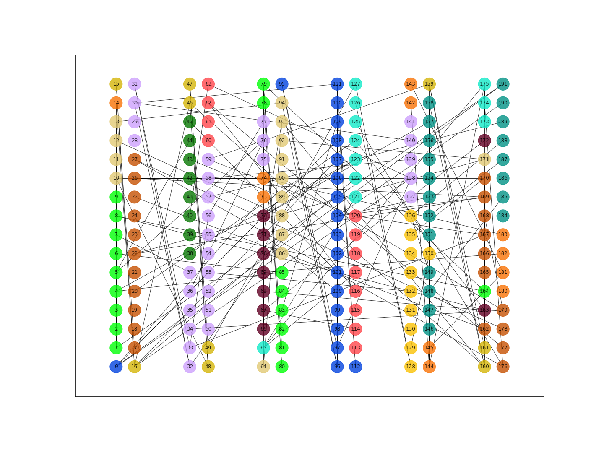
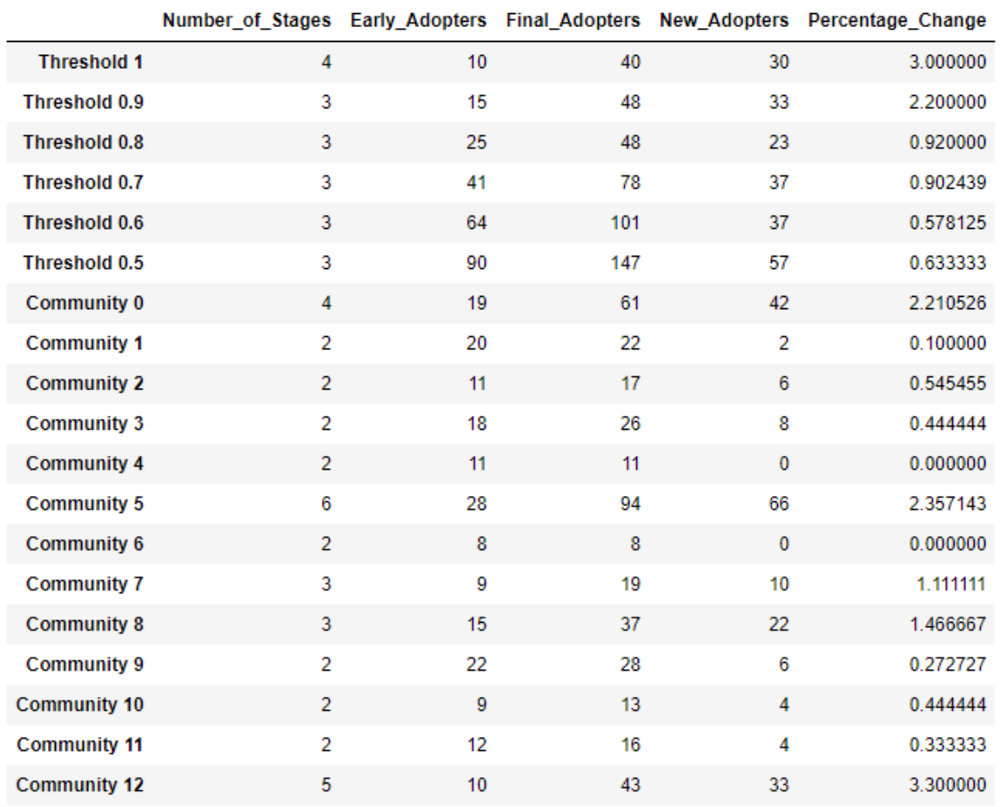

# Project background

The compound of technologies we use to call 'AI' promises to revolutionize many sectors. However, there is a substantial gap between what firms say they do with AI and what they actually do with it. Several factors could account for such a gap: 
1.	the adoption of AI tools is costly since it tends to jeopardize an incumbent's operations  
2.	there is a shortage of human capital trained in the area of AI 
3.	developing AI applcations may require businesses to cope with ethical/societal implications 
4.	and regulatory issue

In the context of knowledge intensive industries, there is yet another obstacle to the diffusion of AI, namely, 'people.' While some professionals may be thrilled to integrate AI in their daily work, some others may just feel threatened. This project deals with the distribution of security traders’ opinions about the impact AI can make on 'trading floors.'

# Dataset

In order to get a better understanding of traders' attitudes toward AI, we have circulated a survey in a large trading floor. The resulting dataset [trading_floor.xml]( https://github.com/simoneSantoni/net-analysis-smm638/blob/9114bedfde4195f2e5ed4fa5c868e3d41b26f939/finalCourseProject/trading_floor.xml) contains 192 responses regarding:
- the undirected network of knowledge exchange between traders (traders A and B are connected when A says he/she shares technical and industry knowledge with B and vice versa)
- a trader's opinion about the contribution of AI to his/her productivity and effectiveness in evaluating securities (1 = not at all; 10 = to a great extent). In the datasets, this variable is reported as the node attribute ai.

Regarding the traders' location in the floor. 
There are six zones, each of which hosts 32 individuals (16 individuals on each side of the zone). In the dataset, the location of traders is reported as two node attributes, that is, x-pos and y-pos.

# Project context

This project aims to help an investment bank to sustain the diffusion of AI. Specifically, the bank would like to persuade traders to engage more with AI tools when it comes evaluating securities.

Here are the steps for the analysis:
1.	Map traders' opinions onto the knowledge exchange network
2.	Map traders' opinions map onto the physical layout of the trading floor
3.	Identifying network-related obstacles to the diffusion of positive opinions about AI in the trading floor
4.	Provide recommendation to promote the diffusion of positive opinions about AI in the trading floor.

# Results

The provided Network referred to the knowledge exchange between traders in the same floor. So it is an one-mode, undirected and unweighted network with 192 nodes-traders- and 384 edges.

In addition, it can be seen that is a connected network without isolates with diameter of 9 and average path length of 4.7. Moreover, the positions of each trader are given along with his/her preference in AI. It can be seen that on average the Network has neutral to slightly negative preference about the adoption of ai (4.69) probably because of the novelty of the technology or from the knowledge intensive subject of securities. However, there are some very strong supporters of ai with preference scores higher than 9/10.

 

These opinions are spread in the trading floor and we can see that some close nodes seems to have similar preferences towards AI, but these is something to examine because despite their close position can not have a knowledge exchange interaction.

 

In order to assess which nodes had the more influence on the Network we need to understand the network’s structure and the connectivity of each node. A first metric that examine that is the degree distribution.

 

Based on the graph, the distribution of the degrees of the nodes seem to follow the normal distribution with most variables have 4 degrees and equal amount of more and less connected nodes. Also we can see that we have 1 node that is very well connected (7 degrees). This can be an indication of potential hubs in the network. In order to examine that we will use centrality measures of each node.

 

For the matrix above we can see that the degree centrality is not much correlated with betweenness centrality and eigenvector centrality, this indicates that all the nodes aren't necessary connected in similar way and so the network deviates form a random structure. Moreover, the Betweenness centrality can differ substantially for nodes with the same degree which indicates a potential modularity of the network and some nodes can be more important than others in the connectivity of those structures. Specifically, we can see that there is 1 clear hub and another 4 nodes that are well more connected that the others. However in order to diffuse the positive opinion of AI we need to examine this modularity’s indication because they can oppose barrier in our process. One potential obstacle in a core-periphery setting of this diffusion can be a conservative position of the core nodes which in general control the flow of information in the network and can act strategically based on their preference.

 

The heatmap significantly deviates from the Adjacency Matrix proposed by Borgatti and Everett meaning that there is not evidence of Core-periphery structure. Another important barrier of the diffusion is the existence of densely connected communities. By using the Girvan Newman algorithm we can detect 13 communities with densities range (0.12-0.42) which indicates some potential obstacles of diffusion of AI innovation. This communities are displayed in the trading floor and it can be seen that closer in the physical space nodes tends to be in the same community.

 

In order to examine this relationship of distance in Ai preferences , we compute the similarity of each pair of nodes connected with an edge and regress them with their distances in the physical space. Based on the results of the regression we can see that the physical distance of each node doesn’t affect the node’s AI preferences (p-value= 0.82>0.05 and R2 =0.00). Having a better understanding of the Network, we can try initiate the diffusion of the innovation using a model of direct-benefits effected proposed by Stephen Morris in order to model the Cascading Behavior in the Network. The model propose that each node’s tendency to adopt an behavior depends on self-interest and the proportion of neighbors adopting. To indicate the self-interest we calculate the payoff of each node of the potential adoption base on his/her AI preference. Then we simulate multiple diffusion cases with different thresholds above which all the nodes become adopters and then by assigning each community as early adopters.

 

The results shown that on average the diffusion stops after 3 stages and the maximum number of adopters appeared in threshold 0.5. Lastly, the nodes of the community 5 (including hub) along with those with AI preferences higher than 9/10 is the most influential regarding the spread of the innovation. Consequently, in order for the client to promote the diffusion of positive opinions about AI in the trading floor and influence the most trader, the analysis recommend two courses of action. Firstly, to educate the traders about the benefits of AI in their work in order to increase the preferences of neutral ones and secondly to start the diffusion of innovation from nodes in the 5th community and those with preference above 9/10.
